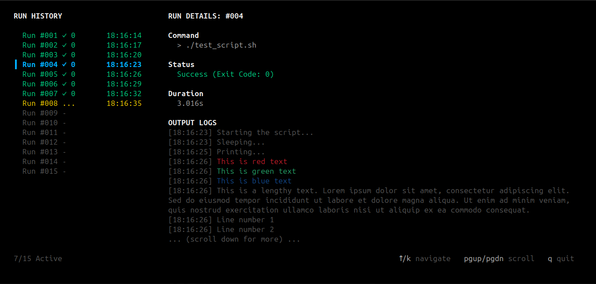

# again - <sub><sup>`v0.1.0-beta`</sup></sub>

**again** is a high-performance CLI utility designed to execute commands repeatedly while providing a rich, interactive Terminal User Interface (TUI). Perfect for debugging flaky tests, benchmarking scripts, or stress-testing local services.

---



## ✨ Features

* **Interactive TUI:** Real-time dashboard powered by [Bubble Tea](https://github.com/charmbracelet/bubbletea) with live output streaming and history navigation.
* **Flexible Outputs:** Support for `TUI`, `JSON` (for automation), and `Raw` (standard stdout) formats.
* **Built for Reliability:** Sequential execution with output size protection to prevent resource exhaustion.
* **Intuitive Controls:** Navigation via arrows/page keys and graceful cancellation with `Ctrl+C`.
* **Cross-Platform:** Native support for Linux, macOS, and Windows.

## 🚀 Installation

### From Source

```bash
# Clone and build manually
go build -o bin/again cmd/again/main.go

# Or using the Taskfile
task build
```

## 🛠 Usage

```bash
again [flags] -- <command>
```

### Quick Examples

| Use Case | Command |
| --- | --- |
| **Standard TUI** | `again -n 10 -- echo "Hello World"` |
| **Flaky Test Check** | `again -n 50 --format json -- go test ./...` |
| **Benchmark** | `again -n 100 -f json -- ./script.sh` |
| **Raw Stream** | `again -n 5 --format raw -- date` |

### Configuration Flags

* `-n, --times` : Number of iterations (Default: `1`).
* `-f, --format` : Output mode: `tui`, `json`, or `raw`.
* `-v, --verbosity` : Logging level: `silent`, `normal`, or `verbose`.
* `-h, --help` : Show help information.

---

## 📊 Output Modes

### 1. JSON (Machine Readable)

Ideal for CI/CD pipelines and scripting.

```json
{
  "results": [
    {
      "id": 1,
      "exit_code": 0,
      "success": true,
      "duration_ms": 5.2,
      "stdout": "...",
      "stderr": ""
    }
  ]
}

```

### 2. Raw

Direct stdout/stderr pass-through with minimal headers for logging.

---

## 🏗 Architecture

The project follows **Clean Architecture** principles to separate business logic from the CLI and TUI infrastructure:

* `internal/domain`: Core models and logic.
* `internal/app`: Orchestration and execution logic.
* `internal/ui`: Formatter implementations (Bubble Tea, JSON).
* `internal/infra`: Low-level command execution.

---

## 🗺 Roadmap

* [ ] **Verbosity Level:** Implement CLI flag internal plumbing for verbosity (`silent`, `normal`, `verbose`).
* [ ] **Parallel Execution:** Run iterations concurrently with worker pools.
* [ ] **Stop-on-Error:** Immediately halt if a command fails.
* [ ] **Statistics:** Detailed analytics (Avg/Min/Max duration, P95).
* [ ] **Advanced Config:** Custom timeouts and working directory support.


## 📄 License

MIT © msaeedsaeedi. See [LICENSE](https://www.google.com/search?q=LICENSE) for details.